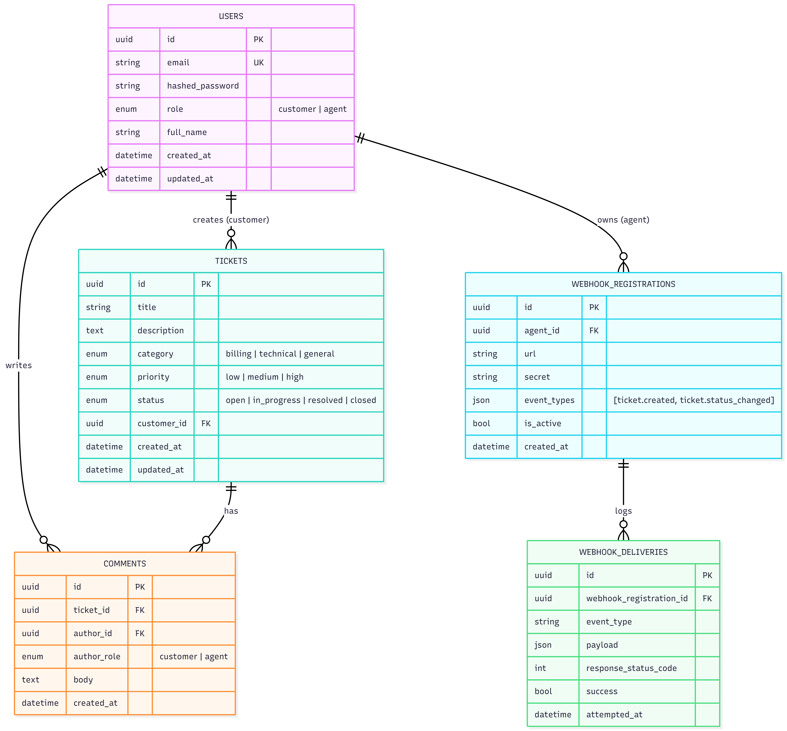
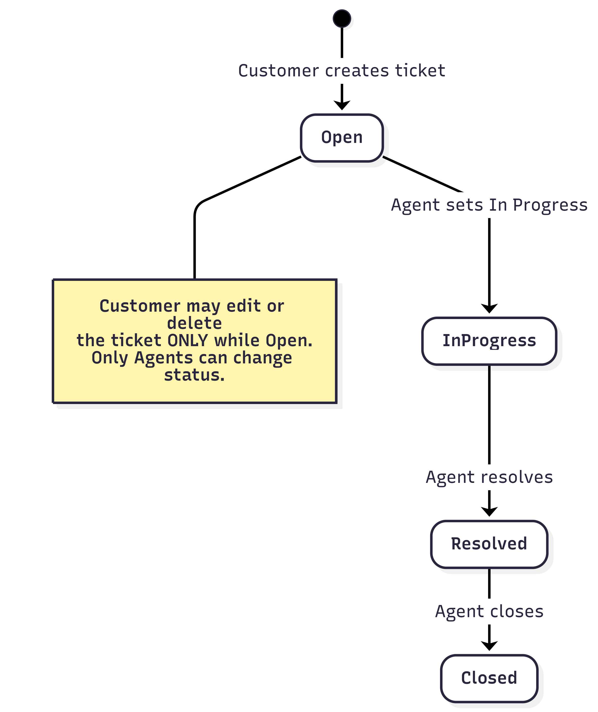

# TicketFlow

Real-time support-ticketing backend  built for Bave's Backend Engineer technical assessment.

Two roles interact with it: **Customers** open and track support tickets; **Agents** triage, comment, and resolve them. The API is REST + JWT auth, live updates stream over WebSockets, hot reads are cached in Redis, and ticket events fire signed outgoing webhooks.

## Tech stack

Python · FastAPI · SQLModel (SQLAlchemy 2.0 async + Pydantic) · PostgreSQL · Redis · WebSockets · Alembic · Docker · `uv`

Chosen because it's the brief's stated preferred stack and mirrors what the role actually builds with day to day.

## Quick start (one command)

```bash
cp .env.example .env
docker compose up --build
```

That's it. On container start, the `api` service automatically runs pending Alembic migrations and seeds the one Agent account  both steps are idempotent, so restarting or rebuilding never duplicates anything or fails on a second run.

Once it's up, these are browser-loadable:

| Service | URL |
|---|---|
| API + Swagger docs | http://localhost:8000/docs |
| API (raw OpenAPI JSON) | http://localhost:8000/openapi.json |
| Health check | http://localhost:8000/health |
| n8n (stretch goal) | http://localhost:5678 |

Postgres (`localhost:5432`) and Redis (`localhost:6379`) are also exposed on the
host, but they speak their own wire protocols, not HTTP — don't open them in a
browser, connect with a DB client instead (`psql`, TablePlus, RedisInsight, or
just `docker compose exec postgres psql -U ticketflow -d ticketflow` / `docker
compose exec redis redis-cli`).

## Environment variables

All defined in `.env.example` with working local defaults — copy it to `.env` and it runs as-is; nothing is required to change for local use.

| Variable | Purpose |
|---|---|
| `POSTGRES_USER` / `POSTGRES_PASSWORD` / `POSTGRES_DB` | Postgres credentials & database name |
| `POSTGRES_HOST` / `POSTGRES_PORT` | Where to reach Postgres — `localhost` for host-run tools (Alembic, local `uvicorn`), overridden to `postgres` *only* for the containerized `api` service via `docker-compose.yml`'s `environment:` block (Docker's internal DNS resolves service names, not `localhost`) |
| `REDIS_HOST` / `REDIS_PORT` | Same host/container distinction as above, override to `redis` in-container |
| `JWT_SECRET_KEY` | Signs access/refresh tokens — change this for any real deployment |
| `JWT_ALGORITHM` | `HS256` |
| `ACCESS_TOKEN_EXPIRE_MINUTES` / `REFRESH_TOKEN_EXPIRE_DAYS` | Token lifetimes |
| `N8N_BASIC_AUTH_USER` / `N8N_BASIC_AUTH_PASSWORD` | Login for the n8n UI (stretch goal) |

## Seeded credentials

One Agent account is created automatically on first boot:

```
email:    agent@ticketflow.dev
password: AgentPass123!
```

Any other account is a Customer  register one via `POST /auth/register` (no self-service Agent signup; see *Key decisions* below).

## API documentation

Full interactive docs (with request/response schemas, examples, and a working **Authorize** button) at **http://localhost:8000/docs**.

| Area | Endpoints |
|---|---|
| Auth | `POST /auth/register`, `POST /auth/login`, `POST /auth/refresh` |
| Tickets | `POST/GET /tickets`, `GET/PATCH/DELETE /tickets/{id}`, `PATCH /tickets/{id}/status` |
| Comments | `POST/GET /tickets/{id}/comments` |
| Dashboard | `GET /dashboard/stats` (Agent-only) |
| Webhooks | `POST/GET /webhooks`, `DELETE /webhooks/{id}`, `GET /webhooks/{id}/deliveries` |
| Real-time | `WS /ws/tickets/{id}`, `WS /ws/dashboard` |

**WebSocket auth differs from REST**: browsers can't set custom headers on a WS handshake, so the access token travels as a query parameter instead: `ws://localhost:8000/ws/tickets/{id}?token=<access_token>`.

## Diagrams

**Entity-relationship diagram** users, tickets, comments, webhook registrations, and delivery logs, with FKs and constraints:



**Ticket status workflow** strictly forward, one step at a time (see *Key decisions* below for why):



## Architecture & key decisions

Layered structure: `api/routes` (HTTP-facing) → `services/` (business logic, framework-agnostic) → `models/` (SQLModel tables) / `schemas/` (Pydantic request/response, kept separate from DB models). `api/deps.py` holds every FastAPI dependency (session/Redis injection, auth, role gates, resource-visibility checks) as reusable, composable building blocks.

A few requirements the brief left ambiguous, resolved and applied consistently:

- **Ticket creation is Customer-only**  the brief frames Customers as the ones who open tickets, Agents as the ones who triage them; an Agent-can-create endpoint wasn't implied.
- **A Customer requesting a ticket they don't own gets `404`, not `403`**  avoids confirming a ticket's existence to someone who can't see it .
- **Status transitions are strictly forward, one step at a time**: `Open → In Progress → Resolved → Closed`. No skipping, no reopening the brief only ever describes the forward path.
- **Webhook registrations are shared across all Agents**, not scoped to whoever created them consistent with Agents already having full shared visibility over every ticket.
- **UUID primary keys** everywhere (not auto-increment) avoids sequential-ID enumeration on a public API.
- **Comments store `author_role` directly** (not joined from `users.role`) an accurate audit snapshot even if a role changed later, and avoids a join on every WebSocket broadcast.

### Cache invalidation strategy

Redis caches two things: the agent dashboard stats (`GET /dashboard/stats`, <=60s TTL) and filtered/paginated ticket lists (`GET /tickets`, 30s TTL, keyed by a hash of the caller's role/id plus every filter and page parameter  so two different users, or two different filter combinations, never share a cache entry).

Invalidation is **explicit, not TTL-only**: every ticket write (create, status change, content edit, delete) immediately deletes the dashboard-stats key and every cached ticket-list key (via Redis `SCAN`, not the blocking `KEYS`, so it stays safe as the keyspace grows) before returning. This trades a small amount of cache efficiency a write briefly clears *all* list variants, not just the ones it actually affected for a strategy that's trivially correct: there's no bookkeeping about which specific filter combinations a given write could have changed, so no room to get that bookkeeping wrong. Comment creation does **not** invalidate anything, since comments don't affect any cached field.

### Real-time (WebSockets)

An in-memory `ConnectionManager` tracks per-ticket "rooms" and one shared Agent-dashboard room. On a new comment or a status change, the event is broadcast to both the specific ticket's subscribers and every connected Agent dashboard matching the brief's "clients subscribed to a ticket **and** Agents subscribed to the dashboard" wording. This is a single-process design; horizontally scaling the API would need a shared pub/sub layer (e.g. Redis Pub/Sub) to fan events across instances, which is out of scope here.

### Webhooks

Registered per Agent-visible endpoint with a generated secret. Every delivery is HMAC-SHA256 signed (`X-TicketFlow-Signature: sha256=<hex>`) over the exact raw request body. Delivery runs as a FastAPI background task (after the triggering response has already been sent, so a slow/dead subscriber never adds latency to the API itself), retries 5xx/network failures up to 4 times with exponential backoff (1s/2s/4s) but *not* 4xx, since a rejected request won't succeed by resending it and every attempt is logged (`GET /webhooks/{id}/deliveries`), sharing one `Idempotency-Key` header across all retries of the same logical event so a receiver can dedupe.

## Stretch goals

Three implemented n8n workflow automation, webhook retries with exponential backoff + idempotency keys, and Redis-backed rate limiting on auth/ticket-creation. Full detail and AI-tool disclosure in [`SUBMISSION.md`](./SUBMISSION.md).

## Running tests / verifying manually

No automated test suite in this submission (not one of the stretch goals picked). The full manual verification path auth, ticket lifecycle, comments, caching, WebSockets, and webhooks end-to-end is what the demo video walks through.
